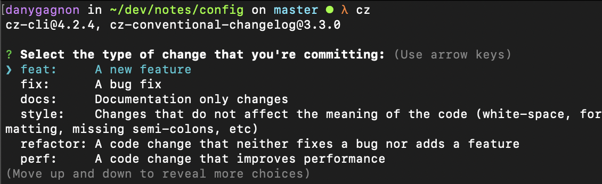

## Commitizen

Commitizen is very important to keep your
commit consistent with the [Conventional Commit Guideline](https://www.conventionalcommits.org/en/v1.0.0/). It adds a command to the terminal.
```console
cz
```
That command brings a menu to help the user commit with the [angular]() convention.



*Figure 1 - image showing cz command in action*

To install the `cz` command in a project, simply run the command -

*PS: Make sure the comitizen package is installed globally before running the second command*

```console
npm i -g commitizen
```

With the `commitizen` installed globally, simply run-

```console
commitizen init cz-conventional-changelog --yarn --dev --exact
```
