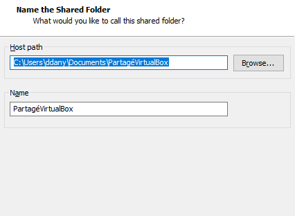
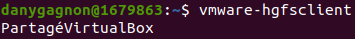
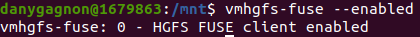

## Semaine 5 SFTP - SCP

**Auteur: Dany Gagnon**

### Transfert de fichier par le biais de VMWare
Pour débuter, il faut être sûre que le partage dans VMWare soit activé. 
Après on créer un Host path pour pouvoir monter l'un des dossier sur la VM.



*Figure 1 - Montre que le shared folder a bien été configuré*

On va démarrer notre VM et on va entrer cette commande dans le terminal-

*ps: `CTRL + ALT + T` pour ouvrir un terminal*

```bash
$ vmware-hgfsclient
```

Pour moi, la commande afficher le dossier partagé au début



*Figure 2 - L'image montre le dossier partagé*

Ensuite la commande-

```bash
$ vmhgfs-fuse --enabled
```



*Figure 3 - L'image montre que fuse est enabled*

Je vais monter mes dossiers dans un dossier Partages sur mon `$HOME` donc-
```bash
$ cd && mkdir Partages
# vmhgfs-fuse .host:/ ~/Partages -o subtype=vmhgfs-fuse,allow_other
```

Ensuite j'utilise la commande `tree` pour visionner le contenu de son dossier. On s'appercoit que
le fichier *shared-folders-vmware.md* est présent, car je l'ai ajouté depuis mon ordinateur windows.
(host)


*Figure 4 - Montre le répertoire partagé sur la machine virtuelle*


*Figure 5 - Montre le répertoire partagé sur le host (Windows)*

Je vais maintenant créer un fichier avec la commande `touch` pour prouvé que les fichier sont transférer
du linux au Host par le dossier partagé.


*Figure 6 - Création d'un fichier from-linux.md*


*Figure 7 - Montre que le fichier est bien présent sur le host*

### Transfert de fichier par SCP

Pour transférer les fichier par SCP, je vais utiliser WinSCP car il est gratuit et *open-source*

On se connect à la machine avec les hostname@\<ip>

```console
u1679863@192.168.80.129
```


*Figure 8 - Montre que la connection a été établie sur le host*


*Figure 9 - Montre que j'ai accès au fichier de la VM par SCP*

Je vais transférer le fichier `copie.txt` de mon Windows à mon Linux


*Figure 10 - Le fichier de base sur le host*


*Figure 11 - Le fichier sur la machine virtuelle aussi*

Bref, on a été capable de transférer des fichiers de deux façons différentes, soit par
VMWare directement (dossiers partagés) et par SCP ou on utilise WinSCP pour
se connecter et nous donner une interface graphique.

